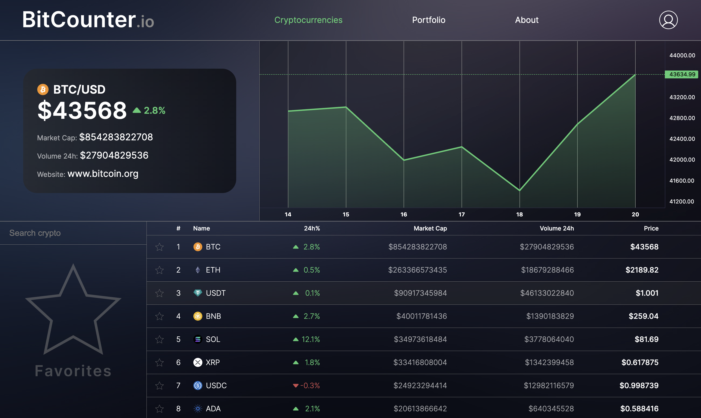
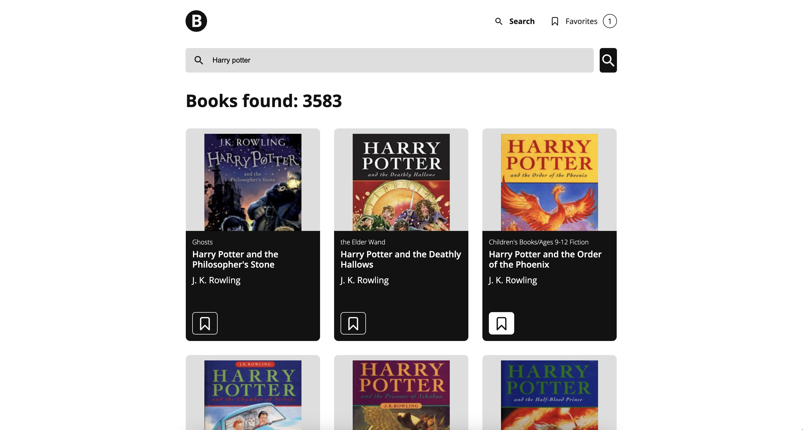
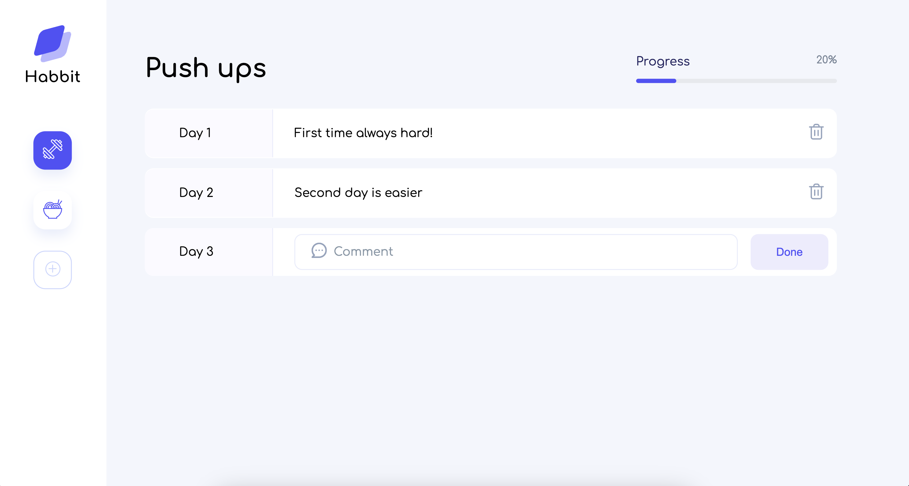

I am a Russian developer, currently studying in Italy

My stack:
<code></code>
<code></code>
<code></code>

## My projects

### <a href="https://github.com/markmxmv/BitCounter">Bitcounter</a>
**Bitcounter** is a tool for monitoring the market of cryptocurrencies and tracking your investment portfolio!
It uses CoinMarketCap API for fetching crypto markets data. Also it uses TradingView LightWeight Chart API for showing asset price value changing.

### <a href="https://github.com/markmxmv/LibraryApp">Libarary App</a>
This web aplication allows you to find any book using OpenLibrary API

### <a href="https://github.com/markmxmv/HabitsTracker">Habits Tracker</a>
Habit Tracker allows you to keep a diary with your feeelings and thoughts during the estimated period of your activity

